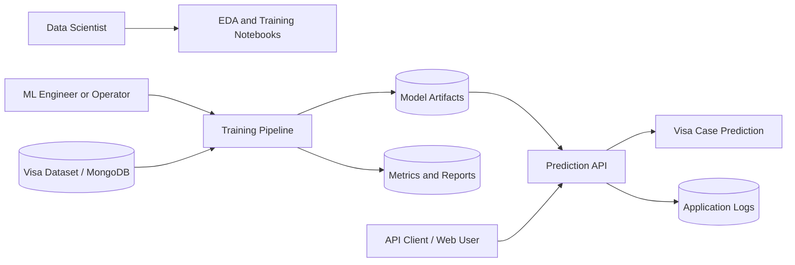
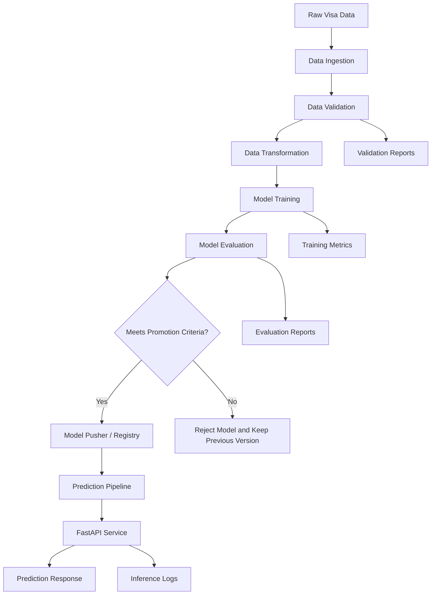
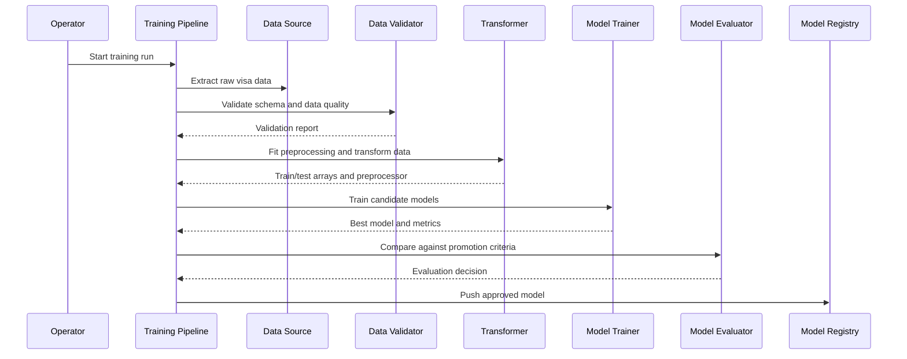
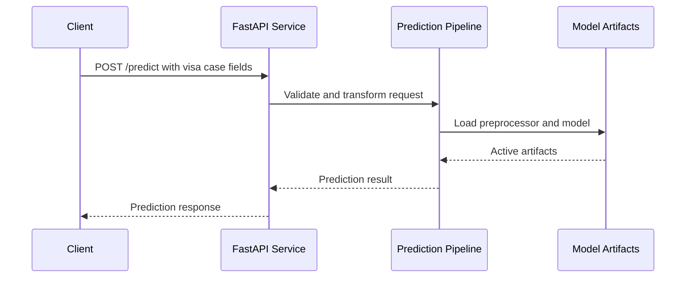

# US Visa Approval Prediction System - High-Level Design

Document status: Draft  
Last updated: 2026-07-01  
Project repository: `end-to-end-machine-learnig-implementation`

## 1. Executive Summary

This project is an end-to-end machine learning system for predicting US visa case outcomes from employer, employee, wage, education, geography, and job attributes. The current repository contains exploratory analysis, feature engineering, model experimentation, a dataset, and a scaffolded Python package intended to support production training and prediction workflows.

The notebook implementation trains a binary classifier where `case_status` is encoded as:

- `Denied` -> `1`
- `Certified` -> `0`

The best notebook result is a tuned `KNeighborsClassifier` with approximately `0.9671` test accuracy, `0.9697` F1 score, and `0.9658` ROC AUC on the resampled test split.

The target production design separates the solution into data ingestion, validation, transformation, model training, evaluation, model promotion, and online prediction services.

## 2. Goals and Scope

### 2.1 Goals

- Build a reproducible ML pipeline for US visa case-status prediction.
- Support both experimentation and productionized model training.
- Validate incoming data against an explicit schema before training or inference.
- Package preprocessing and the trained model as reusable artifacts.
- Expose predictions through a service layer, planned around FastAPI.
- Store logs, metrics, artifacts, and model versions in a controlled way.
- Enable monitoring for model quality and data drift.

### 2.2 Non-Goals

- This system does not make legal immigration decisions.
- This system does not replace official visa adjudication processes.
- This system does not currently provide automated human review workflows.
- This system does not currently include a full CI/CD or model registry implementation.

## 3. Current Repository Snapshot

| Area | Current state |
| --- | --- |
| Dataset | `notebooks/Visadataset.csv`, 25,480 records plus header |
| EDA | `notebooks/1-EDA_US_visa.ipynb` |
| Feature engineering and model training | `notebooks/2_Feature_engineering_and_model_training.ipynb` |
| MongoDB experiment | `notebooks/mongoDB_test.ipynb` |
| Package scaffold | `us_visa/` with components, entities, pipeline, logger, exception, and utility structure |
| Implemented package utilities | Logging, custom exception handling, YAML/object/NumPy helpers in a malformed utility path |
| API entry point | `app.py` exists but is empty |
| Containerization | `Dockerfile` exists but is empty |
| Config | `config/schem.yaml` and `config/model.yaml` exist but are empty |
| Deployment dependencies | FastAPI, Uvicorn, Jinja2, MongoDB, AWS S3 libraries are listed in `requirements.txt` |

## 4. System Context



## 5. High-Level Architecture



The architecture follows a batch-training and online-inference pattern:

- Training is executed on a historical visa dataset.
- Preprocessing and model artifacts are persisted together.
- The API loads approved artifacts and serves predictions.
- Monitoring compares new data and prediction behavior against training baselines.

## 6. Component Design

### 6.1 Data Source Layer

Primary sources:

- Local CSV: `notebooks/Visadataset.csv`
- Planned or experimental MongoDB collection: `US_VISA.VISA_DATA`

Responsibilities:

- Provide raw case records for training.
- Preserve original source columns.
- Support reproducible extraction for a specific training run.

Production recommendation:

- Use environment variables for database connection details.
- Avoid storing credentials in notebooks or source code.
- Define whether CSV or MongoDB is the production source of truth.

### 6.2 Data Ingestion

Target module: `us_visa/components/data_ingestion.py`

Responsibilities:

- Read raw data from CSV or MongoDB.
- Store an immutable raw snapshot for the training run.
- Split data into train and test datasets.
- Emit a `DataIngestionArtifact` containing raw, train, and test paths.

Expected outputs:

- `artifacts/<run_id>/data_ingestion/raw.csv`
- `artifacts/<run_id>/data_ingestion/train.csv`
- `artifacts/<run_id>/data_ingestion/test.csv`

### 6.3 Data Validation

Target module: `us_visa/components/data_validation.py`

Responsibilities:

- Validate required columns.
- Validate data types and allowed categorical values.
- Validate target column presence during training.
- Detect missing values, duplicate records, and unexpected schema drift.
- Produce a validation report.

Important input columns:

| Column | Role |
| --- | --- |
| `case_id` | Unique case identifier, dropped before modeling |
| `continent` | Categorical feature |
| `education_of_employee` | Ordinal categorical feature |
| `has_job_experience` | Binary categorical feature |
| `requires_job_training` | Binary categorical feature |
| `no_of_employees` | Numeric feature |
| `yr_of_estab` | Numeric source feature used to derive company age |
| `region_of_employment` | Categorical feature |
| `prevailing_wage` | Numeric feature |
| `unit_of_wage` | Categorical feature |
| `full_time_position` | Binary categorical feature |
| `case_status` | Training target |

### 6.4 Data Transformation

Target module: `us_visa/components/data_transformation.py`

Notebook transformation logic:

- Drop `case_id`.
- Create `company_age = current_year - yr_of_estab`.
- Encode target as `Denied = 1`, otherwise `0`.
- One-hot encode:
  - `continent`
  - `unit_of_wage`
  - `region_of_employment`
- Ordinal encode:
  - `has_job_experience`
  - `requires_job_training`
  - `full_time_position`
  - `education_of_employee`
- Apply `PowerTransformer(method="yeo-johnson")` to skewed fields:
  - `no_of_employees`
  - `company_age`
- Standardize numeric fields with `StandardScaler`.
- Apply class balancing with `SMOTEENN`.

Production recommendation:

- Persist the fitted preprocessing object with the model.
- Avoid overlapping transformations on the same column unless intentional and documented.
- Move feature lists and category orders into `config/schem.yaml` or a dedicated feature config.

Expected outputs:

- `artifacts/<run_id>/data_transformation/preprocessor.pkl`
- `artifacts/<run_id>/data_transformation/train.npy`
- `artifacts/<run_id>/data_transformation/test.npy`

### 6.5 Model Training

Target module: `us_visa/components/model_trainer.py`

Models evaluated in the notebook:

- Random Forest
- Decision Tree
- Gradient Boosting
- Logistic Regression
- K-Nearest Neighbors
- XGBoost
- CatBoost
- Support Vector Classifier
- AdaBoost

Best tuned notebook model:

| Model | Test accuracy | Test F1 | Test precision | Test recall | Test ROC AUC |
| --- | ---: | ---: | ---: | ---: | ---: |
| KNeighborsClassifier | 0.9671 | 0.9697 | 0.9562 | 0.9837 | 0.9658 |

Best hyperparameters from notebook:

```text
algorithm = auto
n_neighbors = 4
weights = distance
```

Expected outputs:

- `artifacts/<run_id>/model_trainer/model.pkl`
- `artifacts/<run_id>/model_trainer/metrics.json`

### 6.6 Model Evaluation

Target module: `us_visa/components/model_evaluation.py`

Responsibilities:

- Compare candidate model against an existing promoted model.
- Evaluate accuracy, precision, recall, F1, ROC AUC, and confusion matrix.
- Check promotion threshold from `config/model.yaml`.
- Generate model evaluation report.
- Optionally run data drift checks using Evidently.

Recommended promotion gates:

- Minimum F1 score.
- Minimum ROC AUC.
- No severe train-test performance gap.
- No critical data drift.
- Model artifact and preprocessing artifact are both loadable.

### 6.7 Model Pusher / Registry

Target module: `us_visa/components/model_pusher.py`

Responsibilities:

- Promote an approved model version.
- Store model and preprocessor artifacts in a stable serving location.
- Optionally upload artifacts to AWS S3.
- Maintain version metadata, metrics, and training data fingerprint.

Recommended serving layout:

```text
saved_models/
  <version>/
    model.pkl
    preprocessor.pkl
    metrics.json
    schema.yaml
```

### 6.8 Prediction Pipeline

Target module: `us_visa/pipline/prediction_pipline.py`

Responsibilities:

- Accept raw case input without `case_status`.
- Validate input fields.
- Apply the persisted preprocessor.
- Load the promoted model.
- Return predicted class and optional probability/confidence.

Recommended response shape:

```json
{
  "prediction": "Denied",
  "prediction_code": 1,
  "confidence": 0.87,
  "model_version": "2026-07-01-001"
}
```

### 6.9 API and UI Layer

Target file: `app.py`

Planned technology:

- FastAPI
- Uvicorn
- Jinja2 templates if a simple web UI is required

Recommended endpoints:

| Endpoint | Method | Purpose |
| --- | --- | --- |
| `/health` | GET | Service health and model-load status |
| `/metadata` | GET | Active model version and metrics |
| `/predict` | POST | Single prediction |
| `/batch-predict` | POST | Batch prediction from uploaded file |
| `/train` | POST | Optional controlled training trigger |

## 7. Data Flow

### 7.1 Training Flow



### 7.2 Prediction Flow



## 8. Configuration Design

Recommended configuration files:

| File | Purpose |
| --- | --- |
| `config/schem.yaml` | Required columns, data types, allowed values, target column, drop columns |
| `config/model.yaml` | Candidate models, hyperparameter search space, thresholds, active metric |
| `.env` or runtime secrets | MongoDB URI, AWS credentials, artifact bucket, environment name |

Example schema configuration:

```yaml
target_column: case_status
drop_columns:
  - case_id
derived_features:
  company_age:
    source: yr_of_estab
    transform: current_year_minus_value
categorical_columns:
  one_hot:
    - continent
    - unit_of_wage
    - region_of_employment
  ordinal:
    - has_job_experience
    - requires_job_training
    - full_time_position
    - education_of_employee
numeric_columns:
  - no_of_employees
  - yr_of_estab
  - prevailing_wage
  - company_age
```

## 9. Artifact and Storage Design

```text
artifacts/
  <run_id>/
    data_ingestion/
    data_validation/
    data_transformation/
    model_trainer/
    model_evaluation/
saved_models/
  <model_version>/
logs/
```

Artifact metadata should include:

- Run ID and timestamp.
- Git commit hash when available.
- Training data source and row count.
- Schema version.
- Preprocessor version.
- Model class and hyperparameters.
- Evaluation metrics.
- Promotion decision.

## 10. Security and Compliance Considerations

- Do not commit database credentials, cloud keys, or API secrets.
- The MongoDB notebook currently contains a hard-coded connection string; rotate exposed credentials and move secrets to environment variables or a secret manager.
- Treat visa case data as sensitive business data.
- Restrict access to training data, logs, and prediction payloads.
- Avoid logging full request payloads in production unless data is masked.
- Use TLS for database and API traffic.
- Define retention rules for uploaded batch files and generated prediction outputs.

## 11. Observability and Monitoring

Current implementation:

- `us_visa/logger/__init__.py` configures file logging under `logs/`.
- `us_visa/exception/__init__.py` provides contextual exception messages.

Recommended production monitoring:

- Application logs with request IDs.
- Training metrics per run.
- Model latency and prediction counts.
- Input schema validation failure counts.
- Prediction class distribution.
- Data drift and target drift reports using Evidently.
- Alerting when drift, latency, or error-rate thresholds are exceeded.

## 12. Non-Functional Requirements

| Category | Requirement |
| --- | --- |
| Reliability | Training failures must preserve logs and partial diagnostics |
| Reproducibility | Training runs must persist data snapshot, config, metrics, and artifacts |
| Maintainability | Pipeline stages should be modular and config-driven |
| Security | Secrets must be externalized and rotated when exposed |
| Performance | API should load model artifacts once at startup where possible |
| Scalability | Batch prediction should process files in chunks for larger inputs |
| Testability | Unit tests should cover validation, transformation, serialization, and prediction |

## 13. Key Risks and Gaps

| Risk or gap | Impact | Recommendation |
| --- | --- | --- |
| Core pipeline files are empty | Training and prediction cannot run from package modules yet | Implement components incrementally from notebook logic |
| `app.py` is empty | No serving API exists yet | Implement FastAPI endpoints after prediction pipeline |
| `Dockerfile` is empty | No deployable container exists | Add Python runtime, dependency install, and Uvicorn startup command |
| `config/schem.yaml` and `config/model.yaml` are empty | Pipeline cannot be config-driven | Populate schema and model threshold configs |
| Utility file path is malformed under `us_visa/utils` | Imports may fail | Rename to `us_visa/utils/main_utils.py` and keep `__init__.py` separate |
| Typos in package paths such as `pipline`, `configration`, and `artifact_entiy.py` | Reduces maintainability and can confuse imports | Rename before APIs become stable, or maintain aliases |
| Hard-coded MongoDB credentials in notebook | Security exposure | Rotate credentials and remove secret from repository history if needed |
| Notebook preprocessing has overlapping numeric transformations | Can produce duplicated transformed features | Define one explicit transformation per feature group |
| No automated tests | Regressions can slip into pipeline code | Add focused unit and integration tests |

## 14. Implementation Roadmap

### Phase 1: Repository Hygiene

- Fix malformed utility path and package typos where possible.
- Populate schema and model configuration files.
- Move secrets out of notebooks and source files.
- Add a basic `README.md` project overview.

### Phase 2: Production Training Pipeline

- Implement config and artifact entity classes.
- Implement data ingestion from CSV first, then MongoDB if required.
- Implement schema validation.
- Port notebook preprocessing into `DataTransformation`.
- Implement model training and metric reporting.
- Persist preprocessor and model artifacts.

### Phase 3: Model Evaluation and Promotion

- Define promotion thresholds.
- Add model comparison logic.
- Save evaluation reports.
- Implement local `saved_models/` promotion first.
- Add S3-backed model storage if cloud deployment is required.

### Phase 4: Prediction Service

- Implement prediction pipeline.
- Implement FastAPI `/health`, `/metadata`, and `/predict`.
- Add request and response schemas.
- Add batch prediction support.
- Add Dockerfile and deployment startup command.

### Phase 5: Quality, Monitoring, and CI/CD

- Add tests for each pipeline stage.
- Add linting and formatting.
- Add drift reports using Evidently.
- Add CI checks.
- Add deployment workflow.

## 15. Open Decisions

| Decision | Options | Recommended default |
| --- | --- | --- |
| Production data source | CSV, MongoDB, both | Start with CSV for deterministic training, then add MongoDB |
| Model registry | Local filesystem, S3, MLflow | Local first, S3 when deployment target is known |
| Serving mode | API only, web form, batch UI | API first, simple web form second |
| Retraining trigger | Manual, scheduled, drift-based | Manual first, scheduled after monitoring exists |
| Primary metric | Accuracy, F1, ROC AUC, recall | F1 or ROC AUC, with recall tracked for denied cases |

## 16. Acceptance Criteria for HLD Implementation

The HLD is considered implemented when:

- A training command can run the complete pipeline end to end.
- Each pipeline stage writes an artifact and logs meaningful status.
- The trained preprocessor and model can be loaded by the prediction pipeline.
- The API can return predictions for valid request payloads.
- Invalid input returns a clear validation error.
- Model metrics and active model metadata are discoverable.
- Secrets are not stored in source files or notebooks.
- Unit tests cover key transformation and prediction behavior.
